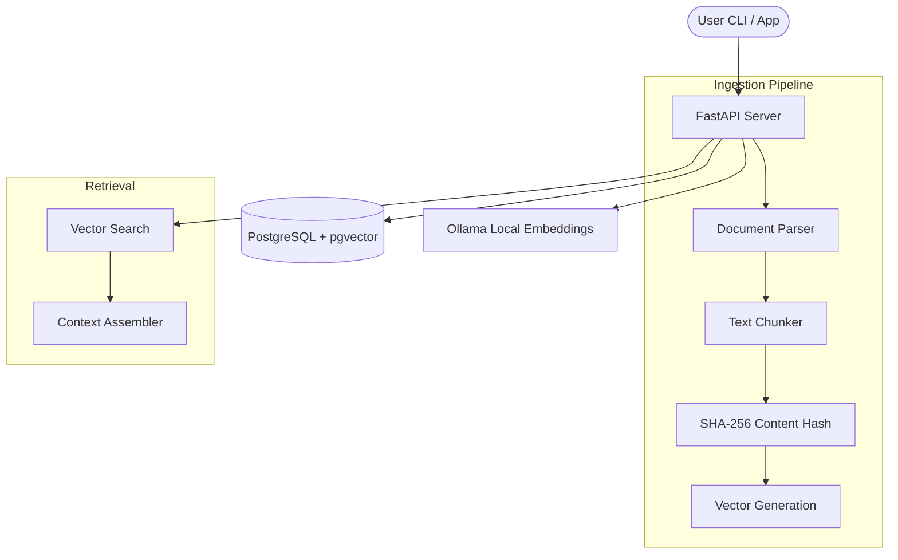

# 🧠 Mnemos

**Self-hosted, Multi-context Memory Server for Developers**

Mnemos is an MCP compatible knowledge server that turns your documentation piles into a multi context memory system. It organizes documents into isolated collections, eliminates redundant processing with content hashing, and runs fully offline using Postgres + pgvector and Ollama.

## Features

- **Multi-context Collections**: Isolate your memory by project (e.g., `react-docs`, `rust-book`, `company-internal`) with case insensitive search filtering.
- **Deterministic Re-ingestion**: SHA-256 content hashing guarantees idempotent operation—skipping unchanged files and automatically re-chunking on diffs.
- **Enhanced Terminal UI**: Explore your context with a full screen search interface, result navigation, and detailed chunk inspection modals.
- **Recursive Site Crawling**: Ingest entire documentation sites with path based filtering (e.g., crawl only `/learn` on `react.dev`).
- **Stable Local Embeddings**: Optimized for Ollama with persistent connections, automatic runner backoff, and load throttling.
- **Chunk Quality Control**: Automatic noise filtering (minimum length thresholds + alphanumeric validation) ensures high quality retrieval.
- **100% Private**: Fully offline. Your context never leaves your local machine.

## Quick Start

### Prerequisites

- Docker & Docker Compose
- Python 3.11+
- [Ollama](https://ollama.ai) (for local embeddings)

### 1. Install Ollama & Pull Embedding Model

```bash
brew install ollama

ollama serve

ollama pull nomic-embed-text
```

### 2. Start the Database

```bash
cd docker
docker-compose up -d
```

### 3. Install Dependencies

```bash
python -m venv venv
source venv/bin/activate
pip install -r requirements.txt
```

### 4. Start the Server

```bash
# Option A: Start via CLI (recommended)
python cli/mnemos.py server

# Option B: Run API directly (development)
uvicorn src.main:app --reload
```

### 5. Add Documents

```bash
python cli/mnemos.py add ./docs/my-document.pdf --collection my-project

# Or crawl a site
python cli/mnemos.py ingest https://react.dev/learn --path-filter /learn --collection react
```

### 6. Search

```bash
python cli/mnemos.py search "how to use useEffect"
```

## CLI Commands

| Command | Description | Flags |
|---------|-------------|-------|
| `mnemos add <path>` | Add a document or directory | `-c <collection>`, `-r` (recursive) |
| `mnemos ingest <url>` | Ingest a URL or crawl a site | `-c <collection>`, `--path-filter` |
| `mnemos search <query>` | Search for relevant context | `-c <collection>`, `-k <limit>` |
| `mnemos list` | List all documents | `-c <collection>`, `-n <limit>` |
| `mnemos export <file>` | Backup knowledge base to JSON | `-c <collection>` |
| `mnemos delete <id>` | Delete a document | `-f` (force) |
| `mnemos server` | Start the API server | `--host`, `--port` |

## API Endpoints

### REST API

Mnemos provides a standard REST API for document management and operations.

| Method | Endpoint | Description |
|--------|----------|-------------|
| `POST` | `/api/documents` | Upload a document |
| `GET` | `/api/documents` | List all documents |
| `GET` | `/api/collections` | List all unique collections |
| `GET` | `/api/documents/export` | Full JSON backup of chunks |
| `DELETE` | `/api/documents/{id}` | Delete a document |
| `POST` | `/api/search` | Vector similarity search |
| `POST` | `/api/ingest/url` | Ingest a single URL |
| `POST` | `/api/ingest/site` | Crawl a documentation site |
| `GET` | `/api/health` | Health & Stats check |

### MCP Endpoints

Mnemos exposes its retrieval capabilities via the Model Context Protocol (MCP), allowing AI agents to query it as an external context provider. Mnemos is designed to be stateless from the MCP client’s perspective; all persistence lives server-side.

| Method | Endpoint | Description |
|--------|----------|-------------|
| `GET` | `/mcp/tools` | List available MCP tools |
| `POST` | `/mcp/call` | Execute an MCP tool |

## MCP Integration

### Claude Desktop

Add to your Claude Desktop config (`~/Library/Application Support/Claude/claude_desktop_config.json`):

```json
{
  "mcpServers": {
    "mnemos": {
      "command": "curl",
      "args": ["-X", "POST", "http://localhost:8000/mcp/call", "-H", "Content-Type: application/json", "-d"]
    }
  }
}
```

### Available MCP Tools

- **search_context**: Search the knowledge base for relevant context
- **list_documents**: List all documents in the knowledge base
- **get_document_info**: Get detailed information about a document

## Configuration

Environment variables (`.env`):

| Variable | Default | Description |
|----------|---------|-------------|
| `DATABASE_URL` | `postgresql+asyncpg://...` | Postgres connection string |
| `EMBEDDING_PROVIDER` | `ollama` | `ollama` (local-first default) or `openai` |
| `EMBEDDING_MODEL` | `nomic-embed-text` | Ollama embedding model |
| `OLLAMA_BASE_URL` | `http://127.0.0.1:11434` | Ollama API URL |
| `CHUNK_SIZE` | `300` | Target characters per chunk |
| `CHUNK_OVERLAP` | `40` | Overlap between chunks |

## Architecture



## Design Principles

- **Local-first by default**: All heavy lifting (vectors/search) happens on your hardware.
- **Deterministic ingestion**: SHA-256 hashing ensures idempotency and safe re-runs.
- **Explicit context isolation**: Multi-collection support prevents cross-project context pollution.
- **Inspectable retrieval**: Similarity scores and chunk metadata are exposed to build trust.
- **Zero vendor lock-in**: Standards-based tech stack (Postgres, MCP, REST).

## Supported Embedding Models

| Model | Dimensions | Notes |
|-------|------------|-------|
| `nomic-embed-text` | 768 | Default, good balance |
| `mxbai-embed-large` | 1024 | Higher quality |
| `all-minilm` | 384 | Faster, smaller |

## Security Posture

- **Local-Only**: By default, Mnemos binds to `0.0.0.0` but does not include authentication. It is intended for local use or behind a secure tunnel.
- **No External Calls**: All vector generation and retrieval happen locally. No telemetry or document data is sent to external servers.
- **SQLi Prevention**: Uses SQLAlchemy ORM and parameterized queries for all database interactions.

## Non-Goals

- **Cloud Hosting**: Mnemos is not designed to be a multi-tenant cloud SaaS.
- **Advanced LLM Orchestration**: It focuses on context provision, not on being a full RAG agent.
- **Browser Automation**: Ingestion is via CLI or URL crawler, not a GUI automation tool.

## Development

```bash
black src/ cli/

pytest tests/
```